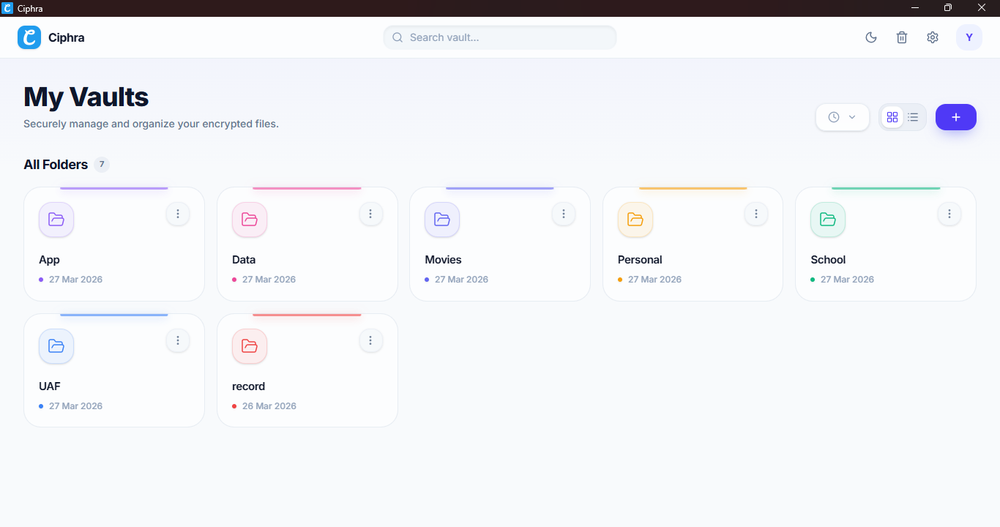

<div align="center">

<h1>
  
  Ciphra
</h1>

*A zero-knowledge encrypted workspace for your documents, notes, and files.*

[](https://github.com/miangee21/ciphra/releases/latest)
[](LICENSE)
[](https://ciphra-app.vercel.app)
[](https://github.com/miangee21/ciphra/releases/latest)
[](https://tauri.app)
[](https://www.patreon.com/posts/buy-me-virtual-153341450)

<br/>

**[📥 Download](#download)**  |  **[✨ Features](#key-features)**  |  **[🖥️ Self Host](#self-hosting)**  |  **[🏗️ Build](#building-from-source)**  |  **[📂 Structure](#folder-structure)**  |  **[💬 Discord](https://discord.com/invite/fcqMjR7K4C)**  |  **[💖 Support](https://www.patreon.com/posts/buy-me-virtual-153341450)**

<br/>



</div>

---

## Table of Contents

- [Overview](#overview)
- [Download](#download)
- [Key Features](#key-features)
- [How the Encryption Works](#how-the-encryption-works)
- [Tech Stack](#tech-stack)
- [Folder Structure](#folder-structure)
- [Self Hosting](#self-hosting)
- [Building from Source](#building-from-source)
- [Made with Love](#made-with-love)

---

<a id="overview"></a>
## Overview

Ciphra is a **zero-knowledge encrypted desktop application** for writing, organizing, and storing your most important information. Built with Tauri v2, every single byte of your data — documents, folder names, file names, images, and PDFs — is encrypted on your device **before** it ever leaves to the cloud.

No passwords. No email. No recovery codes sent to a server. Your **12-word BIP39 mnemonic phrase** is the only key to your vault. Lose it, and nobody — not even the developers — can help you recover access. That is the point.

> *"If we can read it, it isn't really yours."*

---

<a id="download"></a>
## 📥 Download

Choose the easiest installation method for your operating system. All manual download files are securely hosted on our [**Releases page**](https://github.com/miangee21/ciphra/releases/latest).

### 🪟 Windows

**Recommended (via Winget):**
The fastest way to install and keep Ciphra updated on Windows is through the Windows Package Manager. Open your terminal or command prompt and run:

```bash
winget install ciphra
```

**Direct Download:**
If you prefer a manual installation, download the installer of your choice from the [Releases page](https://github.com/miangee21/ciphra/releases/latest):
* `Ciphra_x.x.x_x64-setup.exe` *(Standard NSIS Installer)*
* `Ciphra_x.x.x_x64_en-US.msi` *(Windows MSI Installer)*

### 🐧 Linux

We provide multiple package formats to support your favorite distribution. Grab the latest version from the [Releases page](https://github.com/miangee21/ciphra/releases/latest):

* **Universal:** `ciphra_x.x.x_amd64.AppImage` *(Portable, no installation required)*
* **Debian / Ubuntu:** `ciphra_x.x.x_amd64.deb`
* **Fedora / RHEL / openSUSE:** `ciphra-x.x.x-1.x86_64.rpm`

> 🍎 **macOS:** Not currently published due to Apple notarization requirements. However, you can easily [build from source](#building-from-source).

---

## Key Features

### 🔐 Zero-Knowledge Security
- **BIP39 12-word mnemonic** authentication — same standard used by crypto hardware wallets
- **AES-256-GCM encryption** for all data: documents, folder names, file names, images, and PDFs
- **Private key lives only in RAM** — never written to disk, never sent to any server
- **Public key stored on Convex** — used only to identify your account
- Refresh the app = session cleared. Your key is gone until you log in again.

### 🔒 App Lock
- Optional **6-digit PIN** that encrypts your RAM key and stores it locally
- **Inactivity auto-lock** — configurable: 1 min, 5 min, 30 min, or 1 hour
- **App close = instant lock** — no data left in memory
- **PIN recovery via 12 words** — verify your mnemonic to reset your PIN
- Logout wipes the PIN from storage with a confirmation warning

### 📁 Folder System
- Create unlimited folders with custom colors and names
- **Star** important folders for quick access in the Starred section
- **Rename, recolor, lock** individual folders
- **Recycle bin** with 30-day auto-deletion via Convex scheduled crons
- **Grid and List view** with sorting by name, date created, and date modified
- Encrypted folder names — Convex never sees what your folders are called

### 📄 Rich Text Editor
- **Full-screen TipTap editor** — no boxes, no borders, just your writing
- **Safe Mode** — document locked by default to prevent accidental edits, one click to enable editing
- **Zoom control** — adjust editor zoom from 70% to 150%
- Slash commands (`/`) for quick formatting: headings, lists, tables, code blocks, dividers
- **Tables** — fully resizable, Google Docs style. Add/remove rows and columns, merge and split cells
- **Text alignment** — left, center, right via dropdown
- Bold, italic, strikethrough, text color, highlight color
- Inline image insertion with **automatic WebP compression** (max 800px width)
- Code blocks with **language selector** and one-click copy button
- **Find & Replace** — Ctrl+F to find, toggle replace mode, replace one or all
- **Focus Mode** — hides all UI, full immersion writing. Press Escape to exit
- **Auto-save** — debounced 500ms after every keystroke, encrypted before saving
- **Word count, character count, reading time** in the status bar
- **Export as PDF** — opens print dialog with clean styling
- **Export as Markdown** — downloads a `.md` file

### 🖼️ File Management
- Upload **images** (JPG, PNG, GIF, WebP) and **PDFs** up to **15MB**
- Files are **encrypted before upload** — Convex storage never sees raw bytes
- **Image thumbnails** — decrypted and rendered in the grid
- **Full-screen viewer** for images and PDFs — Escape to close
- **Download** decrypted file directly from the viewer
- Filter by: All, Images, PDFs, Documents
- Pagination with configurable items per page (5, 10, 20, 30, 50, 100, All)
- Right-click context menu on any file or document

### ♻️ Recycle Bin
- All deleted items go to recycle bin first
- **30-day countdown** shown on each item (color-coded: green → amber → red)
- Restore any item back to its original location
- Permanent delete with confirmation modal
- **Empty bin** button to wipe everything at once
- Auto-purge via Convex daily cron job — no manual cleanup needed

### ⚙️ Settings
- **Appearance** — Light/Dark mode toggle with live preview cards
- **Security** — App Lock toggle, PIN setup, timeout configuration, change PIN
- **Storage** — Visual storage usage bar with percentage and breakdown
- **Data** — Delete account Permanently

### 🎨 UI & Experience
- Light and Dark mode with smooth transitions
- Premium glassmorphism design throughout
- Animated empty states with 3D floating effect
- Breadcrumb navigation — Home → Folder → Document
- Back button on all inner pages
- Custom 4px scrollbar that matches the theme
- Splash screen with animated progress bar

---

## How the Encryption Works

```
Your 12 Words (BIP39)
        │
        ▼
   mnemonicToSeed()           ← @scure/bip39
        │
        ▼
   PBKDF2 (100,000 iterations, SHA-256)
        │
        ├──► Private Key (AES-256-GCM)  ─── stays in RAM only
        │
        └──► Public Key (SHA-256 hash)  ─── stored in Convex
                                             used as account identifier

When you encrypt any data:
   plaintext + Private Key → AES-256-GCM (random 12-byte IV) → base64 ciphertext
   IV is prepended to ciphertext → single base64 string stored in Convex

When you decrypt:
   base64 → split IV (first 12 bytes) + ciphertext → AES-256-GCM decrypt → plaintext

This happens 100% on your device. Convex only ever sees encrypted base64 strings.
```

**What Convex stores:**
- Encrypted folder names (`nameEncrypted`)
- Encrypted document titles (`titleEncrypted`)
- Encrypted document content (`contentEncrypted`)
- Encrypted file names (`nameEncrypted`)
- Encrypted file bytes (uploaded to Convex Storage)
- Your public key (used only to find your account on login)

**What Convex never sees:**
- Your 12 words
- Your private key
- Any plaintext content
- Any readable file data

---

## Tech Stack

| Layer | Technology |
|-------|-----------|
| Desktop Shell | Tauri v2 (Rust) |
| Frontend | React 18 + TypeScript + Vite |
| Styling | Tailwind CSS v4 + shadcn/ui |
| Backend / Database | Convex (real-time, serverless) |
| Editor | TipTap v3 |
| Encryption | Web Crypto API (AES-256-GCM) |
| Mnemonic | @scure/bip39 (BIP39 standard) |
| State Management | Zustand v5 |
| Routing | React Router v7 |
| Icons | Lucide React |
| Notifications | Sonner |
| ZIP Export | JSZip + FileSaver |

---


<a id="folder-structure"></a>
## 📂 Folder Structure

A complete and exhaustive breakdown of the Ciphra project architecture, including all frontend features, serverless backend files, native desktop integration, and their specific purposes.

```text
ciphra/
├── .github/
│   ├── assets/
│   │   ├── app.png                           # App screenshot for README
│   │   └── icon.png                          # App logo
│   └── workflows/
│       └── release.yml                       # GitHub Actions — builds all platforms
│
├── convex/                                   # Convex backend (serverless functions)
│   ├── _generated/                           # Auto-generated by Convex CLI
│   │   ├── api.d.ts                          # TypeScript definitions for API
│   │   ├── api.js                            # Compiled API endpoints
│   │   ├── dataModel.d.ts                    # Schema data types
│   │   ├── server.d.ts                       # Server types
│   │   └── server.js                         # Compiled server code
│   ├── auth.ts                               # User create / login / delete
│   ├── crons.ts                              # Daily auto-delete scheduled job
│   ├── documents.ts                          # Document CRUD + recycle bin
│   ├── files.ts                              # File upload / storage / recycle bin
│   ├── folders.ts                            # Folder CRUD + recycle bin
│   ├── recycleBin.ts                         # Internal purge mutation
│   ├── schema.ts                             # Database schema (all tables)
│   ├── README.md                             # Convex backend documentation
│   └── tsconfig.json                         # TypeScript config for backend
│
├── src-tauri/                                # Tauri Rust backend
│   ├── capabilities/                         # Tauri permission definitions
│   │   └── default.json                      # Default system permissions
│   ├── gen/                                  # Auto-generated by Tauri
│   │   └── schemas/                          # IPC and configuration schemas
│   │       ├── acl-manifests.json
│   │       ├── capabilities.json
│   │       ├── desktop-schema.json
│   │       └── windows-schema.json
│   ├── src/
│   │   ├── lib.rs                            # Rust library and plugin setup
│   │   └── main.rs                           # Tauri application entry point
│   ├── .gitignore                            # Ignored files for Rust backend
│   ├── 2                                     # Tauri v2 flag/lock
│   ├── build.rs                              # Rust build script
│   ├── Cargo.lock                            # Rust dependency lockfile
│   ├── Cargo.toml                            # Rust dependencies and versioning
│   └── tauri.conf.json                       # App config, window size, identifier
│
├── src/                                      # React Frontend
│   ├── components/
│   │   ├── common/
│   │   │   ├── ConfirmModal.tsx              # Generic confirmation dialog
│   │   │   ├── EmptyState.tsx                # Animated empty state with 3D icon
│   │   │   ├── FullScreenViewer.tsx          # Decrypted image/PDF viewer
│   │   │   ├── SearchEmptyState.tsx          # UI for no search results
│   │   │   ├── UpdateProgressToast.tsx       # Progress bar for app updates
│   │   │   └── VerifyPinModal.tsx            # PIN verification modal
│   │   ├── layout/
│   │   │   ├── Breadcrumb.tsx                # Breadcrumb navigation
│   │   │   ├── LogoutModal.tsx               # Secure logout confirmation
│   │   │   └── TopNav.tsx                    # Sticky top navbar
│   │   └── ui/                               # shadcn/ui auto-generated components
│   │       ├── alert-dialog.tsx              # Alert dialog primitive
│   │       ├── badge.tsx                     # Badge primitive
│   │       ├── button.tsx                    # Button primitive
│   │       ├── card.tsx                      # Card container primitive
│   │       ├── checkbox.tsx                  # Checkbox primitive
│   │       ├── context-menu.tsx              # Right-click menu primitive
│   │       ├── dialog.tsx                    # Modal dialog primitive
│   │       ├── dropdown-menu.tsx             # Dropdown primitive
│   │       ├── input.tsx                     # Text input primitive
│   │       ├── popover.tsx                   # Popover primitive
│   │       ├── scroll-area.tsx               # Custom scrollbar container
│   │       ├── separator.tsx                 # Divider primitive
│   │       ├── sonner.tsx                    # Toast notification system
│   │       ├── tabs.tsx                      # Tab navigation primitive
│   │       └── tooltip.tsx                   # Tooltip primitive
│   │
│   ├── features/                             # Core App Modules
│   │   ├── auth/                             # Authentication Flow
│   │   │   ├── components/
│   │   │   │   ├── MnemonicInputGrid.tsx     # Reusable 12-word input grid
│   │   │   │   ├── MnemonicRevealStep.tsx    # Step 2 — show/copy/download 12 words
│   │   │   │   └── UsernameStep.tsx          # Step 1 — username availability check
│   │   │   ├── hooks/
│   │   │   │   └── useLogin.ts               # Login logic + lockout handling
│   │   │   ├── LoginPage.tsx                 # 12-word grid login page
│   │   │   └── SignupPage.tsx                # Multi-step signup orchestrator
│   │   ├── editor/                           # Rich Text Document Editor
│   │   │   ├── components/
│   │   │   │   ├── AlignDropdown.tsx         # Text alignment dropdown
│   │   │   │   ├── CodeBlockComponent.tsx    # Custom code block with copy
│   │   │   │   ├── EditorStatusBar.tsx       # Word count + save status
│   │   │   │   ├── EditorToolbar.tsx         # Formatting toolbar + title + nav
│   │   │   │   ├── ExportMenu.tsx            # PDF + Markdown export
│   │   │   │   ├── FindReplace.tsx           # Find & Replace panel
│   │   │   │   ├── FontSizeDropdown.tsx      # Text sizing controls
│   │   │   │   ├── LinkModal.tsx             # Insert hyperlink modal
│   │   │   │   ├── ResizableImage.tsx        # Inline image resizing
│   │   │   │   ├── SlashCommand.tsx          # '/' command palette
│   │   │   │   ├── TableControls.tsx         # Floating table toolbar
│   │   │   │   ├── TextStyleDropdown.tsx     # Headings and font styles
│   │   │   │   ├── TipTapEditor.tsx          # TipTap instance + extensions
│   │   │   │   └── ToolbarHelpers.tsx        # Helper functions for editor
│   │   │   ├── hooks/
│   │   │   │   ├── useAutoSave.ts            # Debounced encrypted auto-save
│   │   │   │   └── useFocusMode.ts           # Focus mode toggle + Escape key
│   │   │   ├── styles/
│   │   │   │   └── EditorPage.css            # Editor-specific styles
│   │   │   └── EditorPage.tsx                # Full-screen document editor page
│   │   ├── folder/                           # Folder & Vault View
│   │   │   ├── components/
│   │   │   │   ├── CreateDocModal.tsx        # New document modal
│   │   │   │   ├── FileCard.tsx              # Grid card for file/doc
│   │   │   │   ├── FileContextMenu.tsx       # Right-click menu for items
│   │   │   │   ├── FileFilter.tsx            # All/Images/PDFs/Documents filter
│   │   │   │   ├── FileGrid.tsx              # Unified grid with pagination
│   │   │   │   ├── FileListItem.tsx          # List row for file/doc
│   │   │   │   ├── FolderActionBar.tsx       # Filter + sort + view + actions
│   │   │   │   ├── ImageThumbnail.tsx        # Decrypt + render image thumbnail
│   │   │   │   ├── StarredItemsSection.tsx   # Starred items in folder
│   │   │   │   └── UploadFileModal.tsx       # Encrypted file upload
│   │   │   └── FolderPage.tsx                # Folder contents page
│   │   ├── home/                             # Main Dashboard
│   │   │   ├── components/
│   │   │   │   ├── CreateFolderModal.tsx     # New folder creation
│   │   │   │   ├── FolderCard.tsx            # Grid card for folders
│   │   │   │   ├── FolderContextMenu.tsx     # Right-click menu for folders
│   │   │   │   ├── FolderGrid.tsx            # Unified folder grid
│   │   │   │   ├── FolderListItem.tsx        # List row for folders
│   │   │   │   └── StarredSection.tsx        # Pinned/Starred folders
│   │   │   └── HomePage.tsx                  # Root page — all folders grid
│   │   ├── lock/                             # Security & App Lock
│   │   │   ├── components/
│   │   │   │   ├── AppLockSettings.tsx       # Enable/disable/change PIN settings
│   │   │   │   ├── PinInput.tsx              # 6-digit PIN input logic
│   │   │   │   └── PinResetModal.tsx         # Reset PIN via 12 words
│   │   │   └── LockScreen.tsx                # PIN entry screen overlay
│   │   ├── recycle/                          # Recycle Bin
│   │   │   ├── components/
│   │   │   │   ├── ConfirmDeleteModal.tsx    # Permanent delete confirmation
│   │   │   │   ├── RecycleItemCard.tsx       # Grid card for deleted items
│   │   │   │   └── RecycleItemList.tsx       # List row for deleted items
│   │   │   └── RecycleBinPage.tsx            # Recycle bin with grid/list view
│   │   ├── settings/                         # App Settings & Preferences
│   │   │   ├── components/
│   │   │   │   ├── AboutSettings.tsx         # App info, social links, and updates
│   │   │   │   ├── DataSettings.tsx          # Account deletion and data export
│   │   │   │   ├── SettingsSidebar.tsx       # Collapsible sidebar navigation
│   │   │   │   └── StorageSettings.tsx       # Storage bar + space breakdown
│   │   │   └── SettingsPage.tsx              # Settings layout wrapper
│   │   └── splash/
│   │       └── SplashScreen.tsx              # Splash with animated progress bar
│   │
│   ├── hooks/
│   │   └── useInactivity.ts                  # Inactivity timer for app lock
│   │
│   ├── lib/                                  # Core Logic & Algorithms
│   │   ├── crypto/
│   │   │   ├── aes.ts                        # AES-256-GCM encrypt / decrypt
│   │   │   ├── bip39.ts                      # Mnemonic generate / validate / seed
│   │   │   ├── fileCrypto.ts                 # File-specific encryption handling
│   │   │   └── keys.ts                       # Key derivation (PBKDF2 → AES key pair)
│   │   ├── storage/
│   │   │   ├── pinStorage.ts                 # PIN-encrypted localStorage key storage
│   │   │   └── ram.ts                        # In-memory private key store
│   │   └── utils.ts                          # Tailwind class merge utilities
│   │
│   ├── router/
│   │   └── AppRouter.tsx                     # Routes + PrivateRoute guard
│   │
│   ├── store/                                # Global State (Zustand)
│   │   ├── lockStore.ts                      # App lock state + timeout setting
│   │   ├── sessionStore.ts                   # User session (userId, username, publicKey)
│   │   └── themeStore.ts                     # Light/dark mode state
│   │
│   ├── App.css                               # Global styles
│   ├── App.tsx                               # Root — Convex provider, theme, lock
│   ├── main.tsx                              # React entry point
│   └── vite-env.d.ts                         # Vite environment types
│
├── .env                                      # Local environment variables
├── .env.local                                # Convex local deployment URL
├── .env.production                           # Convex production deployment URL
├── .gitignore                                # Git ignore rules
├── components.json                           # shadcn/ui configuration
├── convex.json                               # Convex project configuration
├── index.html                                # Main HTML entry point
├── LICENSE                                   # Open source license
├── package-lock.json                         # NPM dependency lockfile
├── package.json                              # NPM dependencies & scripts
├── README.md                                 # Project documentation
├── tsconfig.json                             # TypeScript base configuration
├── tsconfig.node.json                        # Node environment TypeScript config
├── updater.json                              # Tauri auto-updater endpoint configuration
└── vite.config.ts                            # Vite bundler configuration
```

## Self Hosting

You will need:
- **Node.js** v20+
- **Rust** stable toolchain
- A free **Convex** account

### Step 1 — Clone and install

```bash
git clone https://github.com/miangee21/ciphra.git
cd ciphra
npm install
```

### Step 2 — Set up Convex (development)

In Terminal 1, start the Convex dev server:

```bash
npx convex dev
```

- You will be prompted to log in to Convex (browser opens)
- Select **Create a new project**, name it `ciphra` or anything you like
- Convex automatically creates `.env.local` in your project root with your dev deployment URL

### Step 3 — Run the app in development

In Terminal 2, start the Tauri dev build:

```bash
npx tauri dev
```

The app window will open. Create an account, add folders, create documents — everything is fully functional in development mode.

### Step 4 — Deploy Convex to production

1. Go to your **Convex Dashboard**
2. Open your project → click the **Production** tab
3. Under **Settings**, copy these values:
   - Production Deploy Key — looks like `prod:f...`
   - Convex URL — looks like `https://f***.convex.cloud`
4. Create `.env.production` in your project root:

```env
VITE_CONVEX_URL="https://f*********************.convex.cloud"
```

### Step 5 — Generate signing keys

Tauri requires all distributed builds to be cryptographically signed. Generate your key pair:

```bash
npx tauri signer generate
```

You will be prompted to set a password — choose a strong one and save it somewhere safe.

Create `.env` in your project root:

```env
TAURI_SIGNING_PRIVATE_KEY="your_private_key_here"
TAURI_SIGNING_PRIVATE_KEY_PASSWORD="your_password_here"
```

> **Important:** Add `.env` to your `.gitignore`. Never commit your signing private key to version control.

### Environment file summary

| File | Purpose | Created by |
|------|---------|-----------|
| `.env.local` | Dev Convex deployment URL | Convex CLI (auto-generated in Step 2) |
| `.env.production` | Production Convex URL | You (Step 4) |
| `.env` | Tauri signing keys | You (Step 5) |

---

## Building from Source

### Prerequisites

- Node.js v20+
- Rust stable toolchain — run `rustup update stable`
- **Linux only:** install system libraries first:

```bash
# Ubuntu / Debian
sudo apt install libwebkit2gtk-4.1-dev libssl-dev libgtk-3-dev libayatana-appindicator3-dev librsvg2-dev

# Fedora
sudo dnf install webkit2gtk4.1-devel openssl-devel gtk3-devel libappindicator-gtk3-devel librsvg2-devel
```

### Windows Build

Open PowerShell in the project root. Run these commands in order:

```powershell
# 1. Deploy Convex schema and functions to production
$env:CONVEX_DEPLOY_KEY="prod:f**********************************"
npx convex deploy

# 2. Set signing key environment variables
$env:TAURI_SIGNING_PRIVATE_KEY="your_private_key_here"
$env:TAURI_SIGNING_PRIVATE_KEY_PASSWORD="your_password_here"

# 3. Build the app
npx tauri build
```

**Output files** (inside `src-tauri/target/release/bundle/`):

| File | Description |
|------|-------------|
| `msi/Ciphra_x.x.x_x64_en-US.msi` | Windows Installer package |
| `nsis/Ciphra_x.x.x_x64-setup.exe` | NSIS installer executable |

### Linux Build

The Convex production deployment only needs to be done once. If you already ran `npx convex deploy` on Windows, skip that step here.

Open a terminal in the project root:

```bash
# 1. Set signing key environment variables
export TAURI_SIGNING_PRIVATE_KEY="your_private_key_here"
export TAURI_SIGNING_PRIVATE_KEY_PASSWORD="your_password_here"

# 2. Build the app
npx tauri build
```

If you encounter AppImage build errors, use this alternative command:

```bash
NO_STRIP=1 APPIMAGE_EXTRACT_AND_RUN=1 npm run tauri build
```

**Output files** (inside `src-tauri/target/release/bundle/`):

| File | Description |
|------|-------------|
| `appimage/ciphra_x.x.x_amd64.AppImage` | Universal Linux portable app |
| `deb/ciphra_x.x.x_amd64.deb` | Debian / Ubuntu package |
| `rpm/ciphra-x.x.x-1.x86_64.rpm` | Fedora / openSUSE / RHEL package |

---

<div align="center">

<br/>

Made with ❤️ by [Hassan](https://github.com/miangee21)
